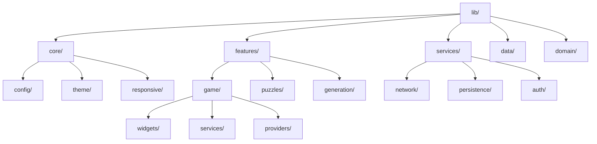
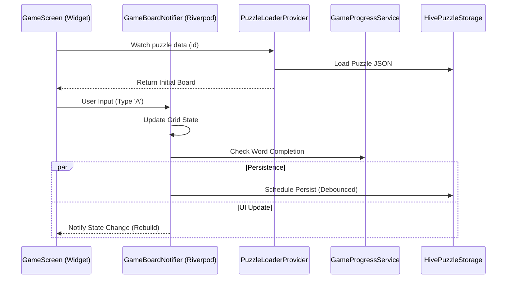

# Architecture Documentation

## Overview

Croiz is a modern Flutter-based crossword game built with a **Feature-First** directory structure and **Clean Architecture** principles. It relies on **Riverpod 3.0** (Notifier/AsyncNotifier) for state management and dependency injection.

## High-Level Structure

The project is organized by feature, keeping related code (widgets, providers, services) together.



### Key Principles

1.  **Feature Isolation**: Code related to a specific feature (e.g., `game`, `puzzle list`) resides in its own directory.
2.  **Service/Provider Split**:
    *   **Services** (`lib/features/game/services/`): Pure Dart classes containing business logic. They are stateless or manage their own internal state, independent of the UI.
    *   **Providers** (`lib/features/game/providers/`): Riverpod notifiers that wrap services, manage UI state, and expose data to Widgets.
3.  **Data Flow**: Unidirectional data flow. Widgets watch Providers; Providers delegate to Services; Services interact with Repositories/Data Sources.

## Data Flow: Game Session

When a user plays a crossword, the data flows as follows:



### Core Components

*   **`PuzzleLoaderProvider`**: Responsible for fetching the raw puzzle data (from JSON or generation) and transforming it into a `GameBoard` entity.
*   **`GameBoardNotifier`**: The heart of the game loop. It holds the active `GameBoard` state. It handles user intents (typing, moving cursor) and delegates complex logic to specialized services.
*   **`GamePersistenceService`**: Handles saving the game state (grid, found words, timer) to local storage.
*   **`GameProgressService`**: Responsible for restoring saved progress when a puzzle is re-opened and calculating completion percentage.

## Persistence Layer

We use **Hive** for fast, local key-value storage of puzzle progress.

*   **Key Format**: `puzzle_{id}`
*   **Payload**: JSON-compatible Map containing:
    *   `grid`: 2D array of user-entered letters.
    *   `foundWords`: List of completed word IDs.
    *   `elapsedSeconds`: Playtime duration.
    *   `lockedCells`: Coordinates of cells that are "correct" and unchangeable (if configured).

> [!NOTE]
> Persistence is abstracted behind `PuzzleStorageInterface`. While currently implemented with Hive (`HivePuzzleStorage`), it can be migrated to **Isar** or **Drift** without affecting the rest of the app by implementing a new adapter.

## Build & Release

The app is built using standard Flutter commands.

**Obfuscation** is recommended for release builds to protect the source code.

```bash
flutter build appbundle --obfuscate --split-debug-info=./build/app/outputs/symbols
```
